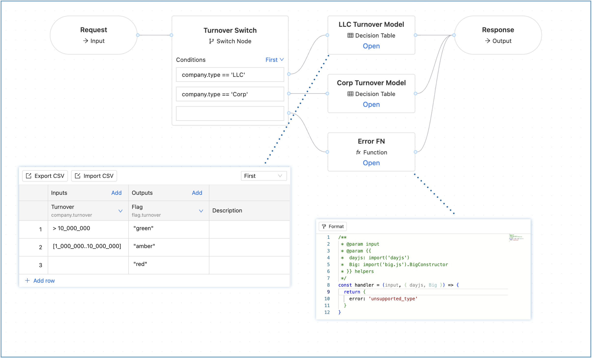
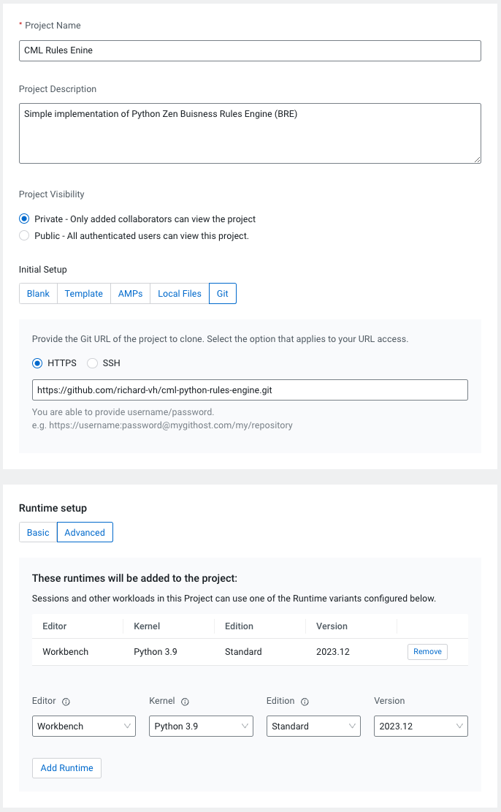
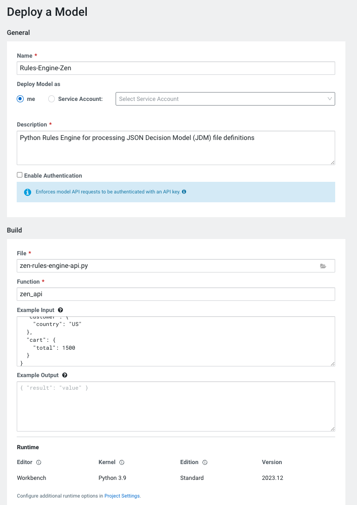

# Python Business Rules Engine (ZEN Engine)

ZEN Engine is a cross-platform, Open-Source Business Rules Engine (BRE). It is written 
in Rust and provides native bindings for NodeJS and Python. ZEN Engine allows to load and 
execute [JSON Decision Model (JDM)](https://gorules.io/docs/rules-engine/json-decision-model) from JSON files.



An open-source editor is available on our [JDM Editor](https://github.com/gorules/editor) repo.

## Open-source Rules Engine Editor with build in Simulator
---
URL: https://editor.gorules.io

### Running via Docker

Running locally:
```bash
docker run -p 3000:3000 --platform=linux/amd64 gorules/editor
```

Repository:
https://hub.docker.com/r/gorules/editor

## Importing as a project into Cloudera Machine Learning (CML)
---
1. Go to your workspace in Cloudera CML and create a new project
2. Give the project a name and desctption and select public or private for your **Project Visibility**
3. For the **Initial Setup** section choose Git, HTTP and paste the link into the Git URL ``https://github.com/richard-vh/cml-python-rules-engine.git``
4. Under **Runtime Setup** choosed Advanced and select a Python 3 runtime.
5. **Create Project**.



## Files
---
Modify the default files to get started with your own project.

* `README.md` -- This project's readme in Markdown format.
* `cdsw-build.sh` -- A custom build script used for models and experiments. This
will pip install our dependencies, primarily the scikit-learn library.
* `zen-rules-engine-api.py` -- A simple API wrapper for loading the JSON Decision Model (JDM) files and runing REST json requests against it.
* `rule-rngine-jdm-files` --  A folder repository the contains the JSON Decision Model (JDM) files for different rules engine
* `images` -- A folder containing images used in the README document


## Launching the Rule Engine as an API REST service
--
1. Click **Models** from the CML menu -> **Create New Mode**.
2. Give the model a name and description and select the authentication type for the REST service API
3. Under the **Build** section, select the **File** as ``zen-rules-engine-api.py``
4. For the **Function** provide the api entry point function name of ``zen-api`` from the ``zen-rules-engine-api.py`` file
5. Provide an **Example Input** of sample JSON, for example:
```
{
  "customer": {
    "country": "US"
  },
  "cart": {
    "total": 1500
  }
}
```
6. Adjust the **Deployment** resoucing as required (can run on 2vCPU/4GiB/1replica) 
6. **Launch** the model


